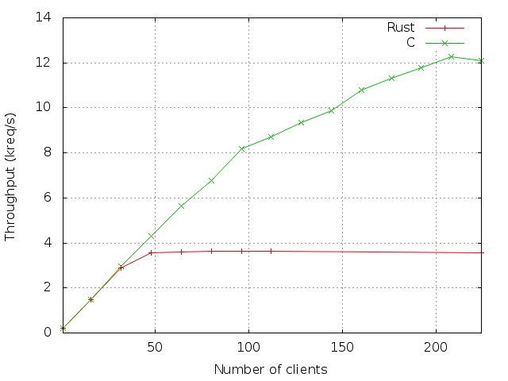
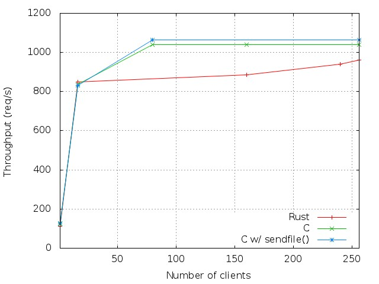

Simple Web Server evaluation
============================

In this document we present a performance analysis of the Rust and C implementation of the web server. Our results show that the Rust server provides bad performance. This performance seems to be related to Rust internal rather than the web server code.

Experimental settings
---------------------

We evaluate the performance of the servers on a cluster composed of 17 identical machines. These machines host two quad-core Intel Xeon E5440 clocked at 2.83GHz, 8GB of RAM and an Hitachi HDT72502 of 250GB running at 7200rpm. They are all connected via a Gigabit network. They run a Linux kernel 3.2 and embed gcc v4.4.5 and Rust v0.6. One machine acts as the server, while the other ones act as clients.

We configure several kernel parameters to get the best performance :

    fs.file-max=786762
    net.core.netdev_max_backlog=400000
    net.core.optmem_max=10000000
    net.core.rmem_default=10000000
    net.core.rmem_max=10000000
    net.core.wmem_default=10000000
    net.core.wmem_max=10000000
    net.core.somaxconn=10000
    net.ipv4.conf.all.rp_filter=1
    net.ipv4.conf.default.rp_filter=1
    net.ipv4.tcp_congestion_control=cubic
    net.ipv4.tcp_ecn=0
    net.ipv4.tcp_max_syn_backlog=10000
    net.ipv4.tcp_max_tw_buckets=1800000
    net.ipv4.tcp_mem=10000000 10000000 10000000
    net.ipv4.tcp_rmem=10000000 10000000 10000000
    net.ipv4.tcp_wmem=10000000 10000000 10000000
    net.ipv4.tcp_sack=1
    net.ipv4.tcp_syncookies=0
    net.ipv4.tcp_timestamps=1
    net.ipv4.tcp_tw_recycle=1
    net.ipv4.tcp_fin_timeout=1

As the C implementation uses mmap to get the files content, we increase the maximum number of mappings on the web server:

    $ cat /proc/sys/vm/max_map_count 
    1000000

Finally, the web server are compiled with optimizations (-O2 for C, -O for Rust) and are configured to serve 1000 files of the same size, present in the same directory. The server pool size is 1 and each thread is pinned to a different core. The clients, which are curl processes, access 1 file chosen at random at a time. Each experiment last 1 minute and is run several times: the standard deviation is less than 2%.

Throughput with requests of 1kiB
--------------------------------

In this section we present the performance of the two implementations with files of 1kiB.

The following figure shows the throughput (in terms of served requests per second) for both implementation as a function of the number of clients.
We observe that, up to 32 clients, both implementation provide the same performance.
Moreover, the C implementation performance increases almost linearly, for a peak throughput of 12.2kreq/s, while the Rust implementation peak throughput is reached with only 48 clients, for a throughput of 3.6kreq/s.
Finally, the C implementation outerpforms the Rust implementation by a factor of 3.4.

One difference between both implementation is the usage of mmap to read files. We suppose that the Rust bad performance could be related to not using mmap. As a consequence we run an experiment where the Rust web server does not read files on disk. Instead, it sends a pre-allocated vector of bytes to the client. We observe a small performance increase: from 3.6kreq/s to 4kreq/s (+11%). We conclude that the bad performance of the Rust web server is not (entirely) due to how files are read.

On another experiment, we deactivate TCP No delay on the C server. The peak throughput is 11.5kreq/s. We conclude the bad performance of the Rust web server is not due to the absence of TCP No delay.

Throughput with requests of 100kiB
--------------------------------

In this section we present the performance of the two implementations with files of 100kiB.

The following figure shows the throughput (in terms of served requests per second) for both implementation as a function of the number of clients.
We observe that the performance of the Rust implementation is better than the C implementation: the peak throughputs are respectively 3.9kreq/s and 1kreq/s. This is an increase by a factor of 3.9.

We run one experiment where each thread of the pool of threads of the C implementation calls *accept()*. We notice the peak throughput remains the same.

We run the Linux profiler, *perf*, on both servers.
We observe that the C server spends 45% of its cycle in the kernel function *__copy_user_nocache*. This means it spends the majority of its time copying  We run experiments where we replace the calls to read() the file and write() to the socket by a single call to the *sendfile()* system call. We observe an important performance gain: the throughput with 256 clients is 13.4kreq/s, instead of 1kreq/s for the base C implementation or 3.8kreq/s for the Rust implementation. Detailed results are shown in the above figure.

Note that the hot spots of the Rust server are quite different: the time is mostly spent in creating/freeing objects. Here is the top 5 of the most costly functions.

1. free: 4.87%
2. pthread_mutex_lock: 3.57%
3. _int_malloc: 3.33%
4. malloc: 3.03%
5. _int_free: 2.55%

Conclusions
-----------

As we have seen, the C implementation outperforms the Rust implementation by a factor of 3.4 for files of 1kiB. We attribute this performance difference to Rust internals (either the compiler, the event-processing loop, or the tasks scheduler).
However, this is not the case with files of 100kiB: this time the Rust implementation is better by a factor of 3.9. This is due to a bad design in the C implementation: this implementation is 3.6 times better than the Rust implementation when it uses the *sendfile()* system call.
Interestingly, the throughput of the Rust web server, in terms of requests per second, is the same whatever the file size, while the throughput of the C web server decreases when the file size increases.

Acknowledgements
----------------

We are grateful to [KrahnacK](https://github.com/KrahnacK) for the insightful comments that helped improve this document.
The experiments presented in this document were carried out using the Grid’5000 experimental testbed, being developed under the INRIA ALADDIN development action with support from CNRS, RENATER and several Universities as well as other funding bodies (see https://www.grid5000.fr).
